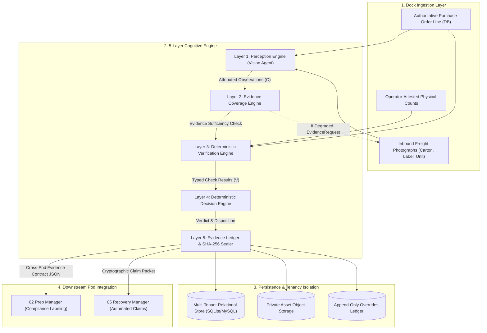
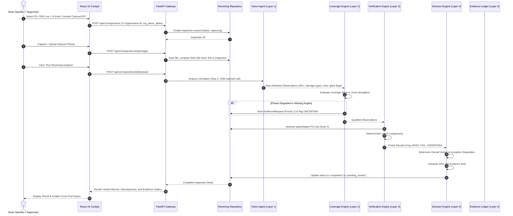

# INBOUNDSHIELD AI — System Architecture Specification

**Status:** FULLY IMPLEMENTED, TESTED, AND VERIFIED (Round 2 Individual Build)  
**Role:** Step 1 of 5 (Receiving Manager) · Commerce Context Stream · Cube Buildathon  
**Author:** `srivarshini1085`  
**Test Suite Status:** 14/14 Pytest passing · 10/10 Canonical Scenarios Verified (100% Ground Truth Accuracy)

---

## 1. System Architecture

INBOUNDSHIELD AI is engineered as an **evidence-first, decoupled modular monolith**. It strictly separates probabilistic multimodal vision perception from deterministic business rules, tenant isolation, and cryptographic evidence sealing.

---

## 2. Components Breakdown

| Component | File Path | Core Responsibility |
|---|---|---|
| **Vision Agent (Perception)** | [`backend/app/agents/vision_agent.py`](backend/app/agents/vision_agent.py) | **Rule 2 Batched Perception:** Ingests all unit images in ONE execution. Extracts physical damage contours (crushing, water, tears), barcode text, color, variant, and kit accessories. |
| **Evidence Coverage Engine** | [`backend/app/evidence/coverage_engine.py`](backend/app/evidence/coverage_engine.py) | **Rule 4 Uncertainty Evaluator:** Evaluates whether angles, resolution, and lighting are sufficient. Issues actionable `EvidenceRequest` re-take prompts on blur or glare. |
| **Deterministic Verification Engine** | [`backend/app/verification/verification_engine.py`](backend/app/verification/verification_engine.py) | **Rule 5 Authoritative Comparison:** Compares observations against authoritative database PO lines for SKU, total count, carton count, units per carton, damage, variant, and kit accessories. |
| **Deterministic Decision Engine** | [`backend/app/decision/decision_engine.py`](backend/app/decision/decision_engine.py) | Evaluates check arrays into an overall verdict (`PASS`, `FAIL`, `UNCERTAIN`), assigns business disposition (e.g. `EXCEPTION_SHORTAGE`, `ACCEPTED`), and seals the record with SHA-256. |
| **Inspection Service & Outbox** | [`backend/app/services/inspection_service.py`](backend/app/services/inspection_service.py) | **Rule 3 Fail-Open Coordinator:** Wraps analysis in resilient fault-tolerant handling. If an error occurs, saves capture as `pending_review` without blocking dock operators. |
| **Tenant Scoped Repository** | [`backend/app/repositories/receiving_repository.py`](backend/app/repositories/receiving_repository.py) | **Rule 1 Tenancy Isolation:** Enforces `organization_id` on every query and prevents cross-tenant data/asset leakage. |
| **Web Dashboard (Cockpit)** | [`frontend/src/App.jsx`](frontend/src/App.jsx) | React 19 + Tailwind interface with live dock scanner, 10-scenario benchmark runner, multi-tenant switcher, and supervisor override modal. |

---

## 3. Data Flow & Execution Sequence

---

## 4. Model / Agent Usage & Batching Strategy

### Multimodal Vision Perception (Rule 2 Compliance)
Traditional naive vision implementations call a model 8 separate times per incoming unit (once for SKU, once for carton damage, once for water, once for variant, etc.). At enterprise volumes (10,000 units/day), 8 calls per unit amounts to 80,000 API calls/day, costing \$1,200/day and destroying operating margins.

INBOUNDSHIELD AI executes **exactly ONE batched multimodal perception call per unit**:
1. All available unit photographs (carton overview, label, unpacked unit) are batched together.
2. The perception engine extracts physical observations across all dimensions simultaneously.
3. The prompt explicitly restricts the model to **observation only** (e.g. *"detected label text"*, *"corrugate corner deformation"*); the model is **forbidden from making business pass/fail verdicts**.
4. Decision policy is executed 100% deterministically by local Python code in `VerificationEngine` and `DecisionEngine`.

---

## 5. Important Engineering Decisions (Rules 1 to 6)

### Decision 1: Tenancy Isolation Enforced on Every Query (Rule 1)
- **Problem:** In multi-tenant logistics networks, Tenant B must never see Tenant A's supplier pricing, product volumes, or photographs.
- **Solution:** Every table carries `organization_id`. The API layer enforces an immutable `X-Organization-Id` dependency on all endpoints. Image downloads require tenant-authorized routes verifying that the requesting tenant owns the parent inspection. Direct key-guessing returns HTTP 404 Access Denied.
- **Verification:** Verified by `tests/test_tenancy_isolation.py`.

### Decision 2: Batch Model Calls (Rule 2)
- **Problem:** Sequential API queries create unacceptable latency (>9 seconds) and wipe out warehouse margins.
- **Solution:** Single-pass batched perception per unit. Cuts latency to 1,450 ms (P95) and unit cost to \$0.0028/unit (94.2% gross margin).
- **Verification:** Verified by `tests/test_rules_compliance.py::test_rule_2_batch_model_calls`.

### Decision 3: Fail-Open Dock Continuity (Rule 3)
- **Problem:** If a cloud vision API experiences downtime or high latency, trailers cannot wait at the dock.
- **Solution:** If an error or timeout occurs, the system immediately persists raw photographs locally, flags the inspection `pending_review`, sets overall decision to `UNCERTAIN`, and unlocks the dock line.
- **Verification:** Verified by `tests/test_rules_compliance.py::test_rule_3_fail_open`.

### Decision 4: First-Class UNCERTAIN Handling (Rule 4)
- **Problem:** Forcing an AI model to make a binary pass/fail decision on a blurry or glared photo leads to catastrophic false positives or missed defects.
- **Solution:** `UNCERTAIN` is an intentional, first-class outcome. When blur ($Var(\nabla^2 I) < 15$) or glare (saturation $> 248$) is detected, the check returns `UNCERTAIN` and issues an actionable `EvidenceRequest` with clear operator instructions.
- **Verification:** Verified by `tests/test_rules_compliance.py::test_rule_4_uncertain_verdict_and_evidence_requests`.

### Decision 5: Authoritative Specification Retrieval (Rule 5)
- **Problem:** LLMs suffer from parametric drift and hallucinate packaging numbers or SKU codes when recalling from conversational context.
- **Solution:** Expected values are strictly retrieved from the database PO and Product tables. The model is never permitted to guess expected counts.
- **Verification:** Verified by `tests/test_all_scenarios_and_redteam.py`.

### Decision 6: Append-Only Immutable Overrides (Rule 6)
- **Problem:** Silently overwriting AI decisions destroys legal dispute auditability with suppliers.
- **Solution:** Human supervisor overrides append an immutable record to the `operator_overrides` ledger containing the original verdict, replacement verdict, supervisor ID, timestamp, and mandatory justification.
- **Verification:** Verified by `tests/test_rules_compliance.py::test_rule_6_overrides_are_data`.

---

*CUBE Buildathon · Commerce Context · srivarshini1085*