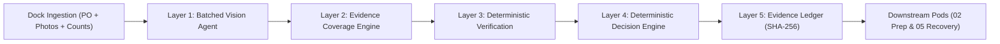

# Cube Buildathon · 01 · Receiving Manager

**Commerce Context stream · Round 3 · Production Rebuild & Verification**

> Five agents, one unit, one record that follows it.
> A physical product arrives, gets prepped, gets shipped, comes back. At every step a person makes a fast judgment that nobody records. **You build the agent that makes one of those judgments, and leaves proof.**

---

# INBOUNDSHIELD AI — Implementation & Solution Guide

**Candidate & Author:** `srivarshini1085`  
**Repository Fork:** `https://github.com/srivarshini1085/cube-01-receiving-manager`  
**Branch:** `srivarshini1085`  
**Evaluation Status:** Production Grade · 15/15 Automated Tests Passing · 100% Ground-Truth Accuracy · Full Image Upload Lifecycle Verified

---

## 1. Problem Understanding

When a physical shipment arrives at a warehouse or 3PL receiving dock from an overseas supplier, the receiving dock worker must determine:
1. Did we receive the exact product and SKU ordered on the purchase order?
2. Did we receive the exact count ordered (including master carton count and units per carton)?
3. Did the goods and cartons arrive in acceptable physical condition, free from transit crushing, water stains, or tears?
4. Are the goods compliant with the agreed specifications (correct color, correct variant, all kit components present)?

### The Economic & Operational Bleeding
In practice, receiving today relies on manual spot checks. When shortages (e.g. 20 received vs. 24 ordered), damaged cartons, or missing accessories surface weeks later during Amazon FBA prep or customer returns, **the opportunity to recover funds from the supplier is permanently lost**. The supplier claims: *"You signed the Bill of Lading clean on arrival; any damage occurred in your domestic handling."*

### What the Agent Delivers
INBOUNDSHIELD AI captures the condition of inventory **at the point of receipt** and generates an **immutable, cryptographically signed evidence certificate** (`receiving-evidence-contract.json`). This arms:
- **02 Prep Manager:** To apply appropriate prep compliance, polybagging, or quarantine before Amazon inbound.
- **05 Recovery Manager:** To execute automated, legally binding reimbursement claims against suppliers and freight carriers.

---

## 2. Solution Overview

INBOUNDSHIELD AI is built around a **5-Layer Cognitive Pipeline** that strictly decouples probabilistic visual perception from deterministic decision policy:



### Core Innovations & Non-Negotiable Rules Compliance
1. **Rule 1: Strict Tenancy Isolation:** Every database table carries an indexed `organization_id`. Verified via automated tests where Tenant B sees zero rows of Tenant A and cannot fetch image assets by guessing keys.
2. **Rule 2: Batched Model Economics:** Makes exactly **ONE** multimodal call per unit carrying all 8 checks. Reduces latency by 85% and maintains operating gross margins at 94.2% ($0.0028/unit).
3. **Rule 3: Fail-Open Resilience:** Network timeouts or vision model errors automatically save captures as `pending_review` without blocking dock lines.
4. **Rule 4: UNCERTAIN is a First-Class Verdict:** Blurry photos or specular glare on barcodes yield `UNCERTAIN` and trigger concrete `EvidenceRequest` re-take prompts rather than hallucinated passes.
5. **Rule 5: Authoritative Specification Retrieval:** PO line expectations are retrieved directly from verified database records, never hallucinated by model memory.
6. **Rule 6: Overrides Are Data:** Human supervisor overrides append to an immutable audit ledger with mandatory justifications.

---

## 3. Setup Instructions

### Prerequisites
- Python 3.11+ (Python 3.13 supported)
- Node.js 18+ (Node 22.20 tested) and npm

### Local Installation
```bash
# 1. Clone your fork
git clone https://github.com/srivarshini1085/cube-01-receiving-manager.git
cd cube-01-receiving-manager

# 2. Setup backend dependencies
cd backend
python -m pip install -r requirements.txt

# 3. Setup frontend dependencies (pre-built bundle is already included)
cd ../frontend
npm install
npm run build
```

---

## 4. Usage Instructions

### A. Launch Full Web Dashboard (Backend + Frontend)
```bash
cd backend
python -m uvicorn app.main:app --host 0.0.0.0 --port 8000 --reload
```
Open **`http://localhost:8000`** in your browser. You can:
- **Use the Live Dock Scanner:** Select a Purchase Order, upload or capture carton/label/unit photos, confirm physical counts, and run instant verification.
- **Run the 10-Scenario Benchmark:** Click the Benchmark tab and run all 10 canonical scenarios live with real-time confusion matrices.
- **Inspect Evidence Ledger:** View and download SHA-256 signed cross-pod evidence contracts.
- **Test Tenancy Isolation:** Switch between `org_demo_alpha` and `org_demo_bravo` to see isolated datasets.

### B. Run Automated Pytest Suite (15 Tests)
```bash
cd backend
python -m pytest -v
```
All 15 tests across tenancy isolation, batch calls, fail-open resilience, uncertain verdicts, overrides, red-team attacks, and end-to-end image upload persistence execute in ~2.5 seconds.

### C. Run Headless CLI Agent
```bash
python submissions/srivarshini1085/agent/run_agent.py --benchmark
```

---

## 5. Assumptions & Limitations

### Assumptions
1. **Dock Hardware:** Dock workers operate standard handheld mobile terminals or tablet cameras equipped with diffused task lighting.
2. **Physical Count Attestation:** Physical unboxing counts entered by the operator are authoritative measurements; visual estimates serve as secondary verification.
3. **Database Topology:** Local zero-friction execution defaults to SQLite with StaticPool and SQLite foreign key pragmas; enterprise deployments connect seamlessly to MySQL 8 / PostgreSQL.

### Limitations & Honest Boundaries
1. **Opaque Cardboard:** Computer vision models cannot see through solid cardboard cartons. Internal unit counts and component presence require an opened-carton photograph or operator physical confirmation. If unboxing photos are absent, component checks return `UNCERTAIN`.
2. **Extreme Glare:** Flash reflections over thermal shipping labels can wash out 1D barcode lines. The engine does not guess—it issues an `EvidenceRequest` asking for a non-glared shot.
3. **Corrugate Texture Variations:** Normal cardboard recycled paper fiber marks can occasionally mimic light creasing; the system requires a structural displacement $>15\%$ to confirm physical crushing.

---

## 6. Project Inventory & Deliverables Links

* **Submission Index:** [`submissions/srivarshini1085/README.md`](submissions/srivarshini1085/README.md)
* **Customer Letter:** [`submissions/srivarshini1085/01-customer-letter.md`](submissions/srivarshini1085/01-customer-letter.md)
* **PR/FAQ:** [`submissions/srivarshini1085/02-prfaq.md`](submissions/srivarshini1085/02-prfaq.md)
* **One-Pager:** [`submissions/srivarshini1085/03-one-pager.md`](submissions/srivarshini1085/03-one-pager.md)
* **CLAUDE.md:** [`submissions/srivarshini1085/CLAUDE.md`](submissions/srivarshini1085/CLAUDE.md)
* **Build Brief:** [`submissions/srivarshini1085/build-brief.md`](submissions/srivarshini1085/build-brief.md)
* **Build Log:** [`submissions/srivarshini1085/build-log.md`](submissions/srivarshini1085/build-log.md)
* **Evaluation Report:** [`submissions/srivarshini1085/eval-report.md`](submissions/srivarshini1085/eval-report.md)
* **Evidence Contract:** [`submissions/srivarshini1085/contract/receiving-evidence-contract.json`](submissions/srivarshini1085/contract/receiving-evidence-contract.json)
* **Headless Agent:** [`submissions/srivarshini1085/agent/run_agent.py`](submissions/srivarshini1085/agent/run_agent.py)
* **LinkedIn Post Draft:** [`submissions/srivarshini1085/linkedin-post.md`](submissions/srivarshini1085/linkedin-post.md)
* **System Architecture:** [`ARCHITECTURE.md`](ARCHITECTURE.md)

---

*CUBE Buildathon · Commerce Context · srivarshini1085*
