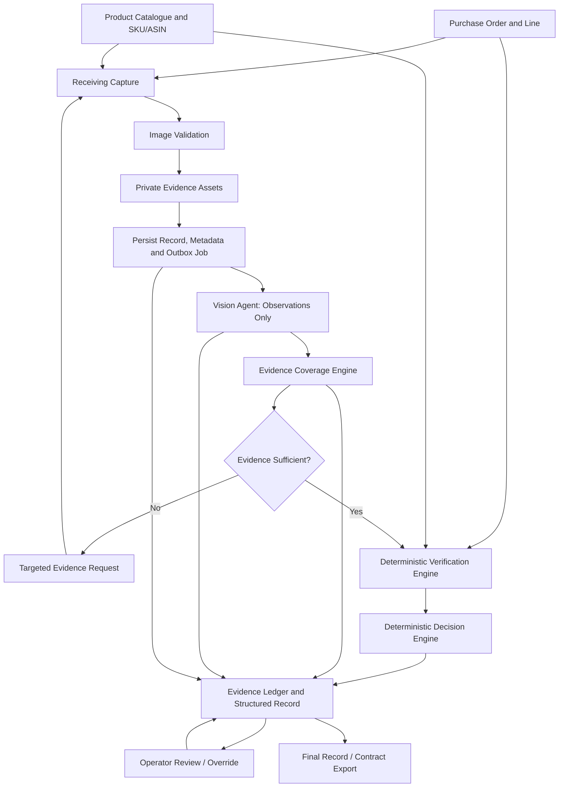

# INBOUNDSHIELD AI Data Flow

**Status:** Proposed end-to-end data flow. This document describes intended behavior only; no application code exists yet.

## 1. Flow Overview



The Vision Agent returns attributed observations only. Evidence Coverage decides whether the available views support a check. The Verification Engine compares typed values against PO/catalogue expectations. The Decision Engine applies deterministic policy. The Evidence Ledger records each stage and the Operator Review appends human review/override events.

## 2. Data Sources and Provenance

Every value crossing the pipeline carries its source. Do not flatten unlike evidence sources into an unlabeled `observed_value`.

| Data | Source | Provenance retained |
|---|---|---|
| Expected SKU, ASIN, colour, variant, components | Tenant catalogue and PO line | Source record, source version/import time, tenant, PO/line |
| Ordered cartons, units/carton and quantity | PO line | Expected field, source and unit of measure |
| Received cartons, units/carton and quantity | Operator-attested count; optional vision estimate remains separate | Actor, capture time, method/source, unit and any supporting evidence |
| Receiving/product photographs | Operator camera or file upload | Private asset ID, content hash, capture time, intended view, validation status |
| AI observations | Versioned multimodal model response | Provider/model/prompt/schema version, run ID, referenced asset IDs/regions, confidence if meaningful |
| Evidence coverage | Deterministic coverage rules | Rule version, check ID, qualifying and missing asset IDs, gap reason |
| Per-check verification | Deterministic comparison | Expected/observed values and sources, comparison rule/version, outcome, rationale |
| Overall verdict | Deterministic Decision Engine | Policy version, exact check-result IDs, outcome and rationale |
| Review or override | Authenticated operator | Actor, timestamp, original/new verdict and mandatory reason |

The `unit_id` is the cross-manager join key when supplied. It is not a tenant authorization token and must not be used as a globally accessible image key.

## 3. End-to-End Sequence

```mermaid
sequenceDiagram
    autonumber
    actor Operator
    participant UI as React UI
    participant API as FastAPI
    participant DB as MySQL 8
    participant OS as Private Object Storage
    participant Worker as Analysis Worker
    participant VA as Vision Agent
    participant VM as Vision Model
    participant CE as Coverage Engine
    participant VE as Verification Engine
    participant DE as Decision Engine

    Operator->>UI: Select PO line; confirm observed counts
    UI->>API: Create receiving session/record
    API->>DB: Persist record and tenant context
    DB-->>API: Record ID
    API-->>UI: Record created
    Operator->>UI: Capture/upload labelled photos
    UI->>API: Request authorized upload
    API->>DB: Authorize tenant and record
    API-->>UI: Short-lived private upload authorization
    UI->>OS: Upload original image bytes
    OS-->>UI: Upload receipt
    UI->>API: Register asset metadata
    API->>DB: Validate association; save asset and outbox job
    API-->>UI: 202 pending
    Worker->>DB: Claim job and load scoped PO/assets
    Worker->>VA: All current images and all visual checks for unit
    VA->>VM: One structured multimodal request
    VM-->>VA: Candidate observation JSON
    VA->>VA: Validate schema and asset references
    VA-->>Worker: Validated observations only
    Worker->>CE: Observations, assets and requirement matrix
    CE-->>Worker: Coverage by check and photo requests
    alt Required evidence missing or ambiguous
        Worker->>DB: Save coverage, request and pending/review state
        UI-->>Operator: Show exact next photo requested
    else Required evidence sufficient
        Worker->>VE: Expectations, observations, counts and coverage
        VE-->>Worker: Per-check comparisons and outcomes
        Worker->>DE: Check results and policy version
        DE-->>Worker: PASS, FAIL or UNCERTAIN with rationale
        Worker->>DB: Persist observations, checks, decision and ledger event
        UI-->>Operator: Show completed decision and supporting evidence
    end
    Operator->>UI: Review or override with reason
    UI->>API: Submit review event
    API->>DB: Append review/override; preserve prior decision
    API-->>UI: Updated history and current status
```

## 4. Lifecycle and State Boundaries

Processing state and business verdict are separate fields.

```text
capturing -> pending -> processing -> completed
                    \-> pending_review -> processing (retry/new evidence)
                    \-> failed_permanent (operational terminal state, reviewable)
```

Only `completed` records have a current automated business verdict. `pending`, `processing`, and `failed_permanent` are not verdicts. When an operator must decide before analysis completes, the UI must show the incomplete state and not imply a system PASS/FAIL. A completed record may have an overall `UNCERTAIN` verdict.

Suggested per-check coverage states are `sufficient`, `missing`, and `ambiguous`. Suggested per-check and overall business outcomes are `PASS`, `FAIL`, and `UNCERTAIN`. Keep evidence-request state (`open`, `fulfilled`, `cancelled`) separate from both.

## 5. Stage Contracts

### Purchase order and catalogue

Input is an authenticated tenant's selected PO line and linked product/variant record. The line supplies expected identifiers and agreed spec. Missing or conflicting expected fields must be surfaced before verification; the model cannot fill them from world knowledge or synthetic examples.

### Receiving capture and image validation

Create the receiving record before analysis. Accept carton exterior, product, label and component views as separately identified assets. Validate actual file bytes and image readability; preserve original bytes and persist validation errors. Only successfully stored, validated assets count as available evidence. Do not claim durable capture after an object-store failure.

### Vision observation

Send all currently available images for the unit and every visual check in one batched request. The response contains typed observations, visibility/ambiguity, evidence references and optional confidence. Validate that each referenced asset belongs to the request. It contains no overall verdict, check PASS/FAIL decision, policy selection or executable action.

### Evidence coverage

For each applicable check, evaluate whether the required evidence types exist and whether observations indicate the relevant feature was visible. Record exact missing/ambiguous reasons. Recommend a concrete capture, such as “photograph the SKU and variant label straight-on so the text is legible,” and associate it with the affected check. Do not call an absent observation a negative observation.

If more photos are captured, create a new evidence-set version. Reprocess as one complete check batch for the unit if permitted by the agreed interpretation of the one-call rule; otherwise route the updated case for deterministic/human review without per-check calls. Keep older observations and decisions in the inspection history.

### Verification

Compare expected and observed structured values with deterministic code. Quantity arithmetic is computed from explicitly sourced count inputs. Preserve operator-entered carton/unit counts separately from visual estimates. The engine returns per-check expected value, observed value, source, evidence references, rule version, rationale and outcome.

### Decision

Apply the versioned aggregation policy after check verification. Recommended initial policy, requiring domain-owner confirmation:

- Any applicable check with a sufficiently supported FAIL makes the overall decision FAIL.
- Overall PASS requires every required applicable check to PASS and the required evidence coverage to be sufficient.
- Otherwise the overall decision is UNCERTAIN.

No numeric acceptance tolerance, channel rule or catalogue default is assumed by this policy. If a rule is required, retrieve and version its authoritative source before enabling that check.

### Evidence ledger and review

Persist a versioned record linking PO values, captured assets, observations, coverage, comparisons, decision and all review events. The record includes model and policy versions and preserves superseded decisions. A human override requires an authenticated operator, timestamp, original verdict, new verdict and reason. Hashes and append-only application events support traceability but are not a claim of immutable storage.

## 6. Failure Paths

| Failure | Durable state and operator-visible behavior |
|---|---|
| Model timeout/provider error | Capture and receiving record remain saved; processing stays `pending`; sanitized error/run metadata is recorded; retry/review is available. No fabricated outcome. |
| Invalid model JSON or unknown asset reference | Reject candidate observations; retain run error details; leave pending/reviewable. Do not create a verdict from invalid output. |
| Missing/poor evidence | Persist the available record/assets; affected checks remain UNCERTAIN or incomplete; show targeted additional evidence request. |
| Unreadable or unsupported image | Record failed validation and reason; exclude from model input/coverage; request a valid recapture. |
| Object storage upload failure | Do not mark the asset available or claim it was durably captured; show retry and preserve upload-attempt state if the database is available. |
| MySQL transaction/outbox failure | Return an error; do not tell the client the record/job was saved. Client retry uses idempotency key. |
| Worker retry/concurrency | Use job lease and run/evidence-set version; stale jobs cannot replace newer decisions. Retain their audit trail. |
| Cross-tenant ID/object attempt | Deny without returning object contents or revealing record existence; emit a security event without logging the submitted secret URL/token. |

## 7. Data Flow Invariants

1. A model observation always points to an asset in its own analysis request and receiving record.
2. A missing/ambiguous/invalid asset cannot support PASS for a check requiring that evidence.
3. Vision output never directly writes a final verdict; deterministic services validate and derive outcomes.
4. Every expected and observed value states its source. Operator input is not mislabeled as model observation.
5. All visual checks for one unit/analysis attempt share a batched model request; never fan out by check.
6. Model failure does not delete the capture or fabricate PASS/FAIL; processing remains pending/reviewable.
7. Every decision is reproducible from referenced check results and a policy version; overrides preserve the earlier decision.
8. Every database and object-storage access is authorized against the authenticated organisation, subject to the unresolved MySQL/RLS acceptance gate.
9. The official cross-manager evidence contract is authoritative for export; these proposed internal fields must be mapped before interoperability is claimed.

## 8. Evaluation Hooks

Each stage emits stable IDs to make evaluation reproducible: fixture/unit ID, evidence-set version, model run, coverage result, check result, decision event and label/adjudication version. For the held-out 50-unit set described by `data/README.md`, retain independent labels from both reviewers and report adjudication.

Measure observation correctness, coverage correctness, targeted-photo usefulness, deterministic comparison correctness, end-to-end decisions, false positives/negatives, UNCERTAIN rate, failure/pending behavior, model calls per unit, latency and cost. Keep evaluation fixture identifiers separate from tenant production identifiers and do not use the synthetic sample as truth.