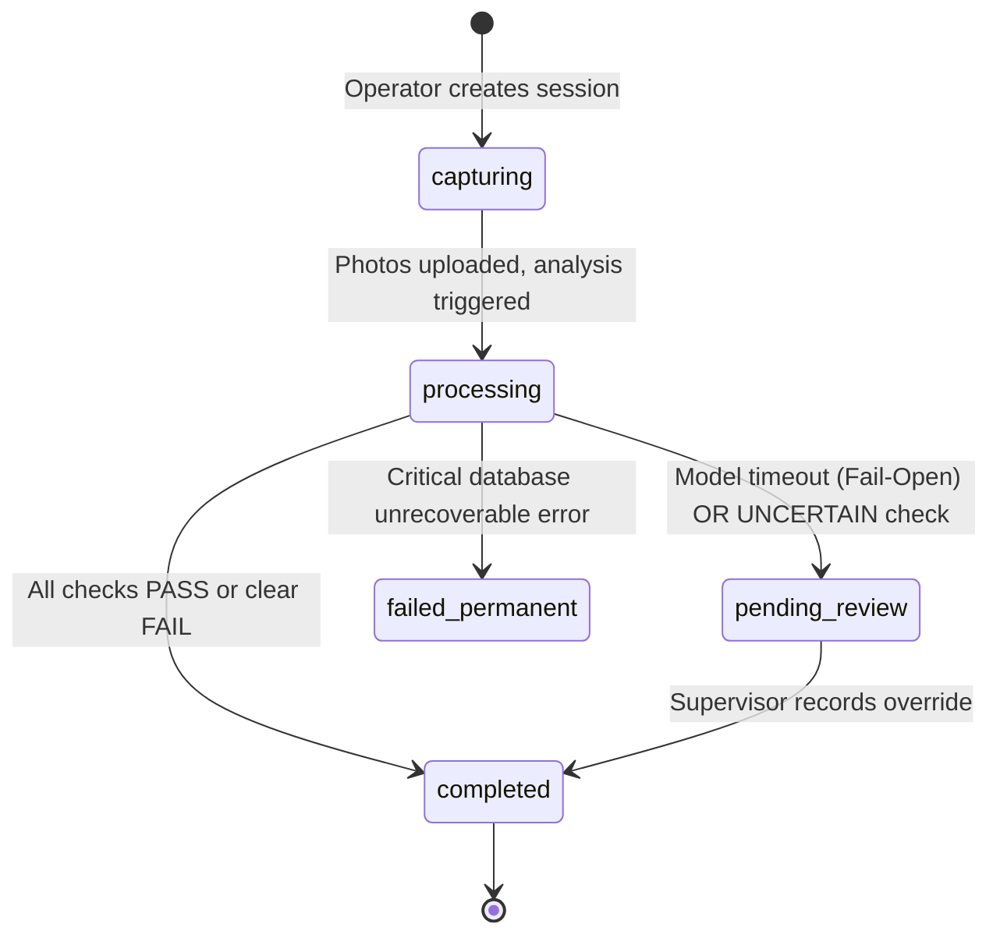

# INBOUNDSHIELD AI: Technical Build Brief

**Commerce Context Stream · Round 2 Individual Build**  
**Role:** Step 1 of 5 — Receiving Manager  
**Author:** srivarshini1085 · **Repository:** `https://github.com/srivarshini1085/cube-01-receiving-manager`

---

## 1. Problem Formalization

A physical inbound shipment $S$ arrives at a warehouse dock from a supplier. The shipment corresponds to a Purchase Order line $P$. The objective of the Receiving Manager is to evaluate a multi-dimensional state vector $\mathbf{X}$ against authoritative expectations $\mathbf{E}$, producing a verifiable decision $D \in \{\text{PASS}, \text{FAIL}, \text{UNCERTAIN}\}$ and an immutable evidence certificate $\mathcal{C}$.

### State Vector Formulation

$$\mathbf{E} = \langle \text{SKU}_e, \text{ASIN}_e, Q_e, C_e, U_e, \text{Color}_e, \text{Variant}_e, \mathbf{K}_e \rangle$$

Where:
- $\text{SKU}_e$: Expected SKU string
- $\text{ASIN}_e$: Expected Amazon Standard Identification Number
- $Q_e$: Expected total units ($Q_e = C_e \times U_e$)
- $C_e$: Expected master carton count
- $U_e$: Expected units per carton (UPC)
- $\text{Color}_e, \text{Variant}_e$: Agreed catalog aesthetics
- $\mathbf{K}_e$: Set of required kit components $\{k_1, k_2, \dots, k_m\}$

$$\mathbf{O} = \langle \text{SKU}_o, \text{ASIN}_o, Q_o, C_o, U_o, \text{Color}_o, \text{Variant}_o, \mathbf{K}_o, \mathbf{\Delta}_c, \mathbf{\Delta}_u \rangle$$

Where:
- $\mathbf{\Delta}_c \subseteq \{\text{crushing}, \text{water}, \text{tears}\}$ represents visible carton damage
- $\mathbf{\Delta}_u \subseteq \{\text{blemish}, \text{seal\_broken}\}$ represents unit damage
- $Q_o = C_o \times U_o$ represents physical count accounting

---

## 2. The 5-Layer Cognitive Pipeline

Rather than relying on an unverified single-prompt LLM, INBOUNDSHIELD AI decomposes inbound inspection into five modular, decoupled engines:

```text
 ┌─────────────────────────────────────────────────────────────┐
 │  Layer 1: Perception Engine (Vision Agent)                  │
 │  Batched single-call visual feature extraction              │
 └──────────────────────────────┬──────────────────────────────┘
                                │ Extracted Observations (O)
                                ▼
 ┌─────────────────────────────────────────────────────────────┐
 │  Layer 2: Evidence Coverage Engine                          │
 │  Evaluates photo angles, glare, blur, and sufficiency       │
 └──────────────────────────────┬──────────────────────────────┘
                                │ Sufficient? (Yes/No)
                ┌───────────────┴───────────────┐
             No │                               │ Yes
                ▼                               ▼
  ┌───────────────────────────┐   ┌───────────────────────────┐
  │ Issue EvidenceRequest     │   │ Layer 3: Verification     │
  │ Set check to UNCERTAIN    │   │ Deterministic comparison: │
  └───────────────────────────┘   │ PO Expectations vs. Obs   │
                                  └─────────────┬─────────────┘
                                                │ Checked Dimensions
                                                ▼
                                  ┌───────────────────────────┐
                                  │ Layer 4: Decision Engine  │
                                  │ Verdict + Disposition     │
                                  └─────────────┬─────────────┘
                                                │ Sealed Record
                                                ▼
                                  ┌───────────────────────────┐
                                  │ Layer 5: Evidence Ledger  │
                                  │ SHA-256 Chained Contract  │
                                  └───────────────────────────┘
```

1. **Layer 1 (Perception):** Ingests $N$ photographs for unit $u$, computes perceptual hashes, Laplacian variance (blur), and saturation statistics (glare), extracting pure observations without deciding correctness.
2. **Layer 2 (Coverage):** Enforces Rule 4. If required views (exterior, label, product) are missing or degraded, marks the check `UNCERTAIN` and issues a concrete `EvidenceRequest`.
3. **Layer 3 (Verification):** Enforces Rule 5. Retrieves authoritative $\mathbf{E}$ from database records and computes typed equality and threshold checks:
   $$V_i = \begin{cases} \text{PASS} & \text{if } O_i = E_i \\ \text{FAIL} & \text{if } O_i \neq E_i \text{ and evidence is sufficient} \\ \text{UNCERTAIN} & \text{if evidence is degraded/insufficient} \end{cases}$$
4. **Layer 4 (Decision):** Synthesizes $\{V_1, \dots, V_k\}$ into overall $D$ and operational disposition (e.g. `EXCEPTION_SHORTAGE`, `EXCEPTION_DAMAGE`, `EXCEPTION_MISMATCH`).
5. **Layer 5 (Ledger):** Computes canonical JSON and seals the record with a SHA-256 cryptographic digest.

---

## 3. Finite State Machine & Lifecycle

An inspection transitions through six deterministic states:



---

## 4. Downstream Pod Integration

### Integration with Step 2 (Prep Manager)
Prep Manager consumes `receiving-evidence-contract.json`. If `overall_verdict == 'PASS'`, the unit advances to standard labeling. If `disposition == 'EXCEPTION_DAMAGE'`, Prep Manager automatically triggers special bubble-bagging, repackaging, or staging in quarantine.

### Integration with Step 5 (Recovery Manager)
Recovery Manager ingests the cryptographic certificate (`certificate_sha256`) and discrepancy tags. It constructs an automated, legally binding supplier dispute claim packet with raw photographic attachments and timestamped operator audit trails.
